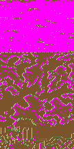

# 最后试一下 · 单图展示计划

> 目标：**在一张地图上同时看到四项提升** —— 画质、可玩性、不同兵种、合适的 AI 战斗 —— 以附件 `Grim's Broken Compass v3` 这张 HoMM3 图为试金石。
> 策略：**不铺量、不追求完美**，只做能在这张 40×40 区域里被玩家直接感受到的改动。

---

## 0. 先验证过的可行性（不是拍脑袋）

附件 `grims_broken_compass_2175/*.h3m` 是 **4 个难度变体** 的同一张 HotA3 PVP 图。我先用探针做了以下验证：

| 验证 | 结果 |
|---|---|
| 文件格式 | gzip 压缩的 h3m，版本 `0x20`（HotA3），`hota format1 = 5`（比公开文档常见的 1/3 更新） |
| 头结构 | 已按公开 spec 解析：版本 + HotA 扩展 + `is_playable` + `map_size` + `has_two_levels` + 名称/描述 |
| 地形块位置 | 用「4 个难度变体在地形上必须完全相同」这一事实定位到 **0x167 附近**；确认存在 163,296 字节（108×108×2 层 × 7 字节/格）的连续相同区 |
| 地形可读 | 每格 7 字节：`terrain_type / terrain_sprite / river_type / river_sprite / road_type / road_sprite / mirroring`；地形类型分布真实（dirt/sand/grass/snow 占绝大多数） |

**预览**（上=地下层，下=地表层）：

结论：**这张图的地表地形可以被我们读出来**。下一步只需截取一个 40×40 区域，转换成我们的地形类型，接入游戏。

> ⚠️ 完整对象层（城镇/英雄/野怪/宝物的精确位置）解析更复杂，计划里**不依赖它**：我们用这张图的地形当画布，对象由现有生成器+场景盖章来放。

---

## 1. 要在这张图里展示什么

| 用户的抱怨 | 对应的改动 | 在这张图里如何被看到 |
|---|---|---|
| 「画面没有提升」 | 修 `G-15` 画质档误判 + 打开氛围层 | 同一张图，旗舰机从「low 档全关」变成有 vignette/暖色叠层/水面反光/城镇辉光 |
| 「可玩性没有提升」 | 单图直开 + UI 减法 + 目标清单 | 打开游戏即进这张图，3 秒内知道要做什么；面板不滚屏 |
| 「兵种都一样」 | 四族兵种树接线（段 2） | 这张图里的四族主城长出的兵完全不同（晨曦骑士 vs 赤焰狼骑 vs 翠林树人 vs 紫晶魔像） |
| 「对手智力没提升」 | AI rush + 难度分层 | 开局 4–8 天内必与 AI 接触；AI 会抢矿、攻城、撤退 |

---

## 2. 四阶段执行计划（建议 3 天 MVP）

### Day 1 · 把图接进来（★ 阻塞项）

**目标**：游戏里能打开一个 40×40 的静态地形场景，且不与现有流程冲突。

| 动作 | 文件/位置 | 说明 |
|---|---|---|
| ① 写 h3m 地形读取脚本 | `homm-web/tools/h3m-terrain.mjs` | 读附件 `.h3m` →  crop 一个 40×40 地表区域 → 输出 `ScenarioStaticTiles` JSON |
| ② 扩展场景系统 | `homm-web/src/core/data/scenarios.ts` | 新增 `ScenarioDef` 类型分支：`static: { width, height, tiles }`；`scenarioGenOptions` 透传 |
| ③ 生成后替换地形 | `homm-web/src/core/map/generator.ts` | `createGame` 在现有生成流程结束后，若 `cfg.scenario === 'grims-showcase'`，用 `static.tiles` 覆盖 `state.map.grid` 的地形 |
| ④ 碰撞检查 | `generator.ts` 内新增 stamp | 替换地形后，检查玩家城堡/矿/英雄是否落在水上或不可走格；若冲突，报错并拒绝生成（方便调区域） |
| ⑤ 新增场景条目 | `scenarios.ts` | `id: 'grims-showcase'`，size 用 `'large'`（40×40），对手 3，难度 normal，aiIntent: 'rush' |

**Day 1 验收**：
- `npm run typecheck` 0 错误
- `node tools/h3m-terrain.mjs` 输出 40×40 JSON
- 浏览器 `?devquick=1&scenario=grims-showcase` 能进入地图，地表与 HoMM3 图_crop 后的地形一致
- 不破坏现有 `tutorial` / `duel`

**Go / No-Go**：如果 Day 1 结束地形还接不进来（比如 HotA 特有地形无法合理映射），**立即转向 B 方案**：不导入 h3m，改用现有生成器手工调一个 40×40 的 `wild`/`ring`/`lanes` 场景，复用这张图的设计结构（四象限主城 + 中央争夺区）。

---

### Day 2 · 四族真的不一样

**目标**：玩家和 AI 在这张图里能造出、招到、看到四族不同的兵。

| 动作 | 文件/位置 | 说明 |
|---|---|---|
| ① 建筑表改 tier | `homm-web/src/core/data/buildings.ts` | `dwell1~5` 的 `growth.unitTypeId` 改为 `'tier1'..'tier5'`，不再硬编码 `peasant/archer/...` |
| ② 城镇三处接线 | `homm-web/src/core/game/town.ts:350/357/358/407/410` | `applyWeeklyGrowth` / `recruitRows` / `build` 改用 `unitIdForTier(owner, tier)` |
| ③ 修增长余数兼容 | `town.ts` + `units.ts` | canonical id 迁移时 `growthPool` / `growthRemainder` 正确映射；旧存档不炸 |
| ④ 冒险地图显示兵种 | `homm-web/src/render/MapRenderer.ts:510` | 已有 `if (!g) return; // T5 等无帧` —— T1–T4 已有帧，接线后自然生效 |
| ⑤（可选）T5 四兵种 | `homm-web/src/render/unitArt.ts` | 若 Day 2 还有余力，补 `p1_overangel` / `p2_lavatroll` / `p3_unicorn` / `p4_colossus` 的 2 帧（地图+战斗）；否则先让 T5 不可招募，不阻塞 |

**Day 2 验收**：
- 进入 `grims-showcase`，四族主城各建 `dwell1` 后招募出的兵 id 不同（晨曦 `p1_lampbearer`、赤焰 `p2_scavenger` 等）
- `node tools/smoke.mjs` 全绿
- 跑 8 局 AI 观战：四族一级兵外观不同（肉眼可辨）

---

### Day 3 · 画质、AI、可玩性一起收尾

| 动作 | 文件/位置 | 说明 |
|---|---|---|
| ① 修 `G-15` 画质误判 | `homm-web/src/render/quality.ts` | 把旗舰机的 `TIER_TABLE` 探测条件从「同时满足若干几乎不可能的条件」放宽；确保 `high` 档不是永远 unreachable |
| ② 氛围层默认开 | `quality.ts` + `MapRenderer.ts` | 在 `grims-showcase` 强制 `vignette / warmOverlay / waterGlint / townGlow / setDressing` 开启，作为画质基线 |
| ③ AI rush 调这张图 | `homm-web/src/core/game/ai.ts` | 确认 `aiIntent: 'rush'` 生效；针对 40×40 四象限布局调 `RUSH_BIAS` / 目标选择，使接触日中位数 ≤ 8 天 |
| ④ 难度真的分层 | `homm-web/src/core/data/factions.ts` + `generator.ts` | 验证 `playerStartMul` / `monsterMul` / `playerMoveMul` 在 easy/normal/hard 生效；同一张图 easy 野怪少、hard 野怪厚 |
| ⑤ 单图 UI 简化 | `homm-web/src/ui/StartScreen.ts` + `main.ts` | 加一个「试这张图」按钮直开；隐藏日志/移动力常驻条；顶部目标清单只显示 3 条：① 探索 30% ② 占领 2 座矿 ③ 击败最近 AI |
| ⑥ 打包真机 | `homm-web/android/` | 走 `mobile:sync` → 出包 → 真机安装 → 截图对比 |

**Day 3 验收**：
- 真机打开游戏，点「试这张图」直接进入；画面有明显氛围层
- 玩一局 normal，第 5–7 天遇到 AI
- 切换 easy，开局资源多、野怪弱；切换 hard，开局资源少、野怪强、AI 更早出门
- 四族主城出兵外观不同

---

## 3. 不做的事（ scope 红线）

为了 3 天能完，以下明确**不做**：

- ❌ 不解析 h3m 的完整对象层（城镇/宝物/野怪的精确 HoMM3 位置）
- ❌ 不实现地下层（这张图有地下，但我们只取地表 40×40）
- ❌ 不做音乐（G-5 保留为后续，不属于"一张图能看"的范畴）
- ❌ 不补 T5 精灵（若时间不够；T1–T4 不同已足够回答"兵种差异"）
- ❌ 不重写整个 UI（只针对这张图做减法）
- ❌ 不扩展地图尺寸到 108×108（保持现有 40×40 上限，crop 使用）

---

## 4. 风险与缓解

| 风险 | 可能性 | 缓解 |
|---|---|---|
| HotA 地形类型（highland/wasteland 等）无法合理映射到我们的 4 种地型 | 中 | 把所有非标准类型归到最接近的 dirt/grass/rough/water；Day 1 预览确认 |
| 替换地形后，生成器放的城市/矿落在水上 | 中 | 冲突检测 + 报错；必要时换一个 crop 区域或微调对象位置 |
| 四族兵种接线改动大，旧存档崩溃 | 中 | 加 `normalizeLegacyUnitIds` 迁移；`save/persistence.ts` 升 VERSION；smoke 测旧存档加载 |
| AI rush 在中型图上仍然不接触 | 中 | Day 3 用 `contactaudit` 实测 16 局接触日；>50% 超过 8 天就再调 `RUSH_BIAS` |
| 画质档修复后低端机掉帧 | 低 | 只改探测条件，不动渲染路径；真机实测 fps |

---

## 5. 决策点

这一页计划 **不在代码里动任何东西**，只等你拍板。你有两个选择：

| 选项 | 含义 | 下一步 |
|---|---|---|
| **A. 按 3 天计划做** | 导入 h3m 地形 + 四族兵种 + 画质/AI/UI 改进 | 我立刻开 Day 1：写 `h3m-terrain.mjs` 并接进场景系统 |
| **B. 只做最便宜的验证** | 不导入 h3m，用现有 40×40 程序图，只改兵种/画质/AI | 1.5 天左右，风险更低，但地图本身不会让人惊艳 |
| **C. 维持停止** | 不再投入 | 保持 `PROJECT-WRAPUP.md` 现状 |

我推荐 **A**，因为这张图已经在你手里，导入地形能带来最直接的"这张图真的跑起来了"的感受， worth the Day 1 风险。

---

## 6. 附件与参考

- HoMM3 图源文件：`/Users/lichao/Downloads/grims_broken_compass_2175/`
- 地形预览：`design/maps/grims-broken-compass-terrain-preview.png`
- h3m 格式参考：HeroWO-js/h3m2json `h3m-The-Corpus.txt`（已 Fetch）
- 现有场景规格：`design/maps/playtest-scenarios.md`
- 现有场景代码：`homm-web/src/core/data/scenarios.ts`
- 项目收尾状态：`PROJECT-WRAPUP.md` §3（三条 P0 未完成）
